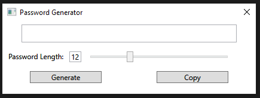

# Password Generator

A basic password generator app written in c# with wpf.

## Usage

1) Use the slider to select the desired password length.
2) Click Generate to automatically generate a strong password of the chosen length.
3) Click Copy to copy the generated password to the clipboard to be pasted where needed.

## Installation

Build with Visual Studio 2022

## Screenshot

